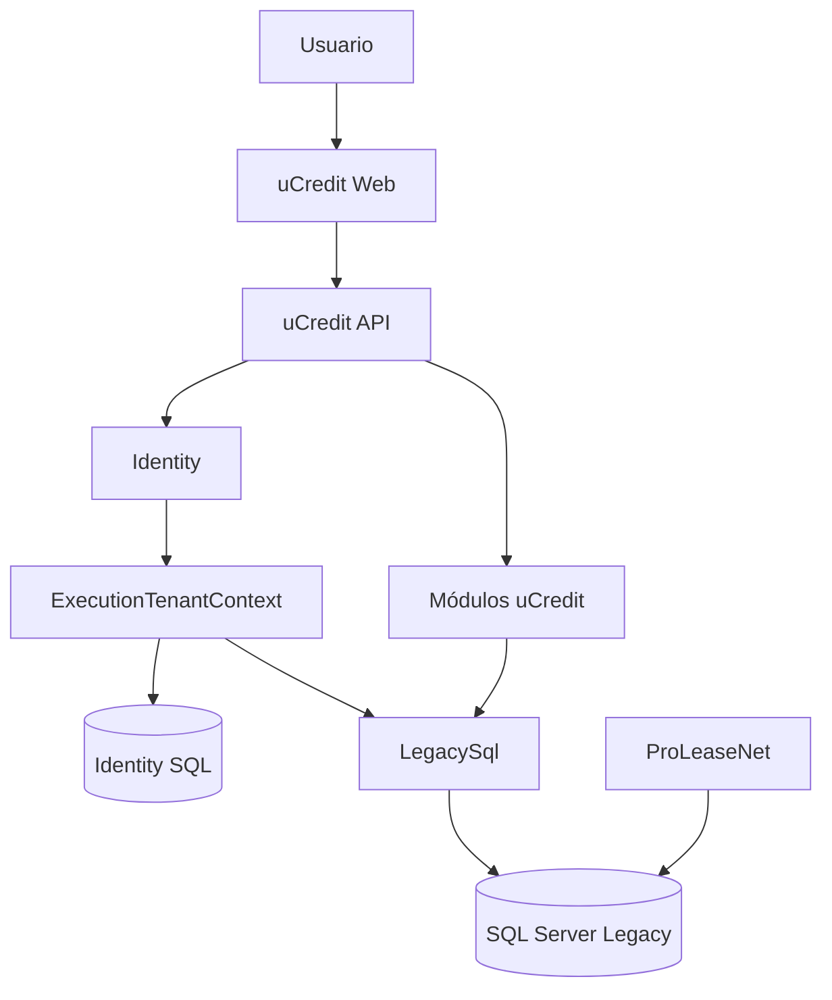

# Arquitectura de uCredit

## Estilo

Monolito modular con frontend separado y una capa anticorrupción para SQL Server Legacy.

## Proyectos del primer vertical

| Proyecto | Responsabilidad |
|---|---|
| `uCredit.Api` | Endpoints, autenticación, autorización y composición |
| `uCredit.Application` | Abstracciones neutrales de ejecución |
| `uCredit.Infrastructure.Identity` | ASP.NET Core Identity, EF Core, tenant permitido y scopes de seguridad |
| `uCredit.Modules.Contracts` | Casos de uso y contratos del módulo |
| `uCredit.Infrastructure.LegacySql` | SQL parametrizado y mapeo Legacy |
| `uCredit.Web` | Interfaz React/TypeScript |
| `uCredit.ArchitectureTests` | Límites de dependencias |
| `uCredit.Modules.Contracts.UnitTests` | Reglas y validación |
| `uCredit.Modules.Contracts.IntegrationTests` | SQL y API contra BD de prueba |

## Dirección de dependencias

- API conoce módulos e infraestructura durante composición y proyecta sus resultados a DTOs HTTP explícitos; los modelos internos no se exponen directamente.
- Módulos no conocen API, Web ni infraestructura.
- `uCredit.Application` no conoce Identity ni LegacySql.
- Identity implementa `IExecutionTenantContext`; LegacySql lo consume.
- Contracts no conoce Identity ni LegacySql.
- Identity y LegacySql no se referencian entre sí.
- Web sólo consume contratos HTTP.
- Modelos SQL no salen de `LegacySql`.

## Persistencia

- Dapper y `Microsoft.Data.SqlClient` para Legacy.
- parámetros tipados y cancelación asíncrona;
- `C.EMP_FL_CVE IN @AllowedCompanyIds` obligatorio en contratos;
- `CMONEDA` se consulta desde `LegacySql` mediante `LEFT JOIN` por su PK, sin filtrar monedas históricas;
- EF Core únicamente para estructuras nuevas justificadas;
- sin migraciones automáticas sobre Legacy.

## Identidad

ASP.NET Core Identity con cookie segura y EF Core únicamente sobre una base nueva configurada mediante `IdentitySql__ConnectionString`. `Deployment__TenantCode` limita la instalación a un tenant. `TenantLegacyCompanyScopes` mantiene los CompanyId activos sin guardar conexiones Legacy. El adaptador `LegacySql` proyecta el catálogo `CMONEDA` y los campos de plazo/fechas a un modelo interno que conserva la nulabilidad Legacy donde corresponde; la API los publica mediante `ContractDetailResponse`. La selección aún usa la cookie firmada como autoridad y no acepta listas desde el navegador. Entra External ID queda como alternativa OIDC postergada.

## Despliegue

Artefactos inmutables promovidos por pipeline. IIS como reverse proxy es la propuesta inicial; TI debe confirmar infraestructura.

## Tabla de amortización

`GET /api/v1/contracts/{contractNumber}/amortization-schedule` es una consulta de sólo lectura protegida por `contracts.read`. `LegacyContractAmortizationReadRepository` valida el contrato mediante `dbo.KCONTRATO`, aplica `C.EMP_FL_CVE IN @AllowedCompanyIds` y obtiene ese alcance exclusivamente de `IExecutionTenantContext`.

La consulta parametrizada lee `dbo.KTPAGO_CONTRATO`, usa `CTP_CL_TTABLA = 1`, selecciona `MAX(CTP_NO_VERSION)` por contrato y tipo, y ordena por `CTP_NO_PAGO`. No filtra `CTP_FG_GENERADO`; el adaptador lo proyecta a `Generated` o `Pending`. Las fechas `datetime` se convierten a `DateOnly`, los importes permanecen `decimal`, el pago cero se proyecta como `downPayment` nullable y `payments` sólo contiene pagos mayores que cero. Contratos fuera del alcance, inexistentes o sin tabla tipo 1 devuelven 404.

La API proyecta el modelo del módulo a un DTO HTTP explícito; los modelos Legacy e identificadores internos no salen de `LegacySql`.

## Branding dinámico

El módulo `uCredit.Modules.Branding` expone un contrato de tema con `productName`, `customerName`, `logoUrl`, `primaryColor`, `secondaryColor`, `browserTitle` y `faviconUrl`, además de los colores semánticos del tema. `GET /api/v1/branding/current` resuelve el tema usando exclusivamente el tenant de la cookie firmada; no acepta `X-Tenant-Code` ni valores de tenant enviados como autoridad por el navegador.

El tenant de demostración `TOYOTA` usa `uCredit-auto` como nombre comercial y `Toyota Financial Services` como cliente. El logo oficial se sirve desde `/branding/toyota/logo.png`, conservando su proporción mediante límites CSS (`max-width`/`max-height` con dimensiones automáticas). Si el asset no existe o falla, la interfaz muestra el fallback textual `uCredit-auto`, conserva el texto alternativo `Toyota Financial Services` y sólo acepta assets bajo `/branding/`.

## Consulta de clientes

El módulo `Customers` representa la entidad funcional `Customer`; “Prospecto” permanece sólo como título Legacy. `GET /api/v1/customers` y `GET /api/v1/customers/{personId}` son consultas de sólo lectura protegidas por `customers.read`. `LegacySql` carga `CPERSONA` y las colecciones de roles, domicilios, teléfonos y correos por separado para evitar multiplicar clientes. Las altas y modificaciones de clientes, propuestas y contratos requieren autorización posterior para escritura Legacy.
