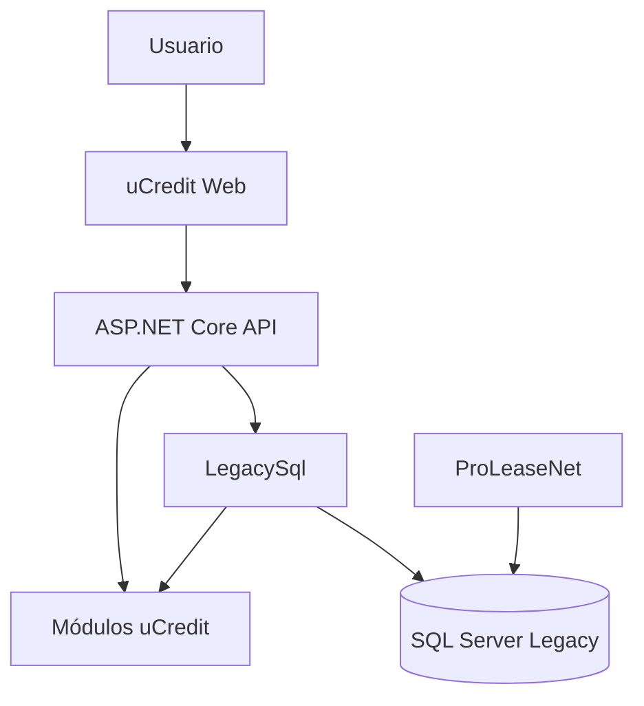

# Arquitectura de uCredit

## Estilo

Monolito modular con frontend separado y una capa anticorrupción para SQL Server Legacy.

## Proyectos del primer vertical

| Proyecto | Responsabilidad |
|---|---|
| `uCredit.Api` | Endpoints, autenticación, autorización y composición |
| `uCredit.Modules.Contracts` | Casos de uso y contratos del módulo |
| `uCredit.Infrastructure.LegacySql` | SQL parametrizado y mapeo Legacy |
| `uCredit.Web` | Interfaz React/TypeScript |
| `uCredit.ArchitectureTests` | Límites de dependencias |
| `uCredit.Modules.Contracts.UnitTests` | Reglas y validación |
| `uCredit.Modules.Contracts.IntegrationTests` | SQL y API contra BD de prueba |

## Dirección de dependencias

- API conoce módulos e infraestructura durante composición.
- Módulos no conocen API, Web ni infraestructura.
- Infraestructura implementa interfaces definidas por módulos.
- Web sólo consume contratos HTTP.
- Modelos SQL no salen de `LegacySql`.

## Módulos previstos

IdentityAccess, Contracts, People, Products, Amortization, Movements, Payments, Collections, Billing, Insurance, Terminations, Accounting, Integrations y Reporting.

Se agregan sólo cuando exista un caso de uso aprobado.

## API

- prefijo `/api/v1`;
- JSON camelCase;
- fechas ISO 8601;
- `decimal` para importes/tasas;
- `ProblemDetails` para errores;
- paginación del lado servidor;
- OpenAPI como contrato verificable;
- autorización por políticas.

## Persistencia

- Dapper y `Microsoft.Data.SqlClient` para Legacy.
- parámetros tipados y cancelación asíncrona;
- conexiones de lectura/escritura separadas;
- EF Core únicamente para estructuras nuevas justificadas;
- sin migraciones automáticas sobre Legacy.

## Identidad

OIDC/OAuth 2.0 con proveedor corporativo por definir. Los permisos de aplicación son semánticos y pueden mapear temporalmente controles Legacy.

## Observabilidad

Logging estructurado, correlación, métricas y trazas mediante OpenTelemetry. Evitar datos personales y secretos.

## Despliegue

Artefactos inmutables promovidos por pipeline. IIS como reverse proxy es la propuesta inicial; TI debe confirmar infraestructura.
